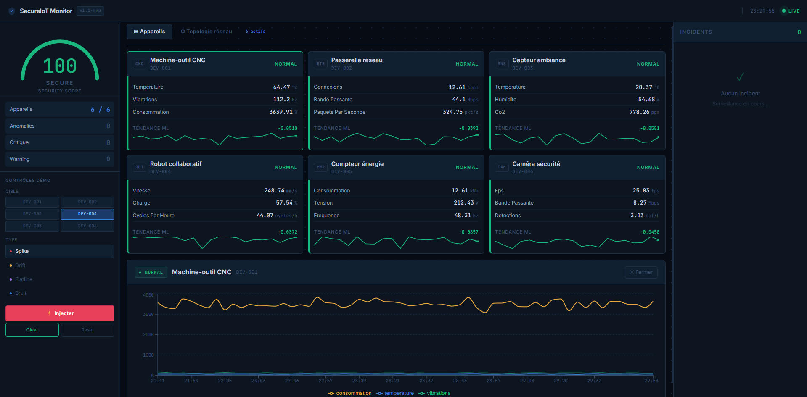
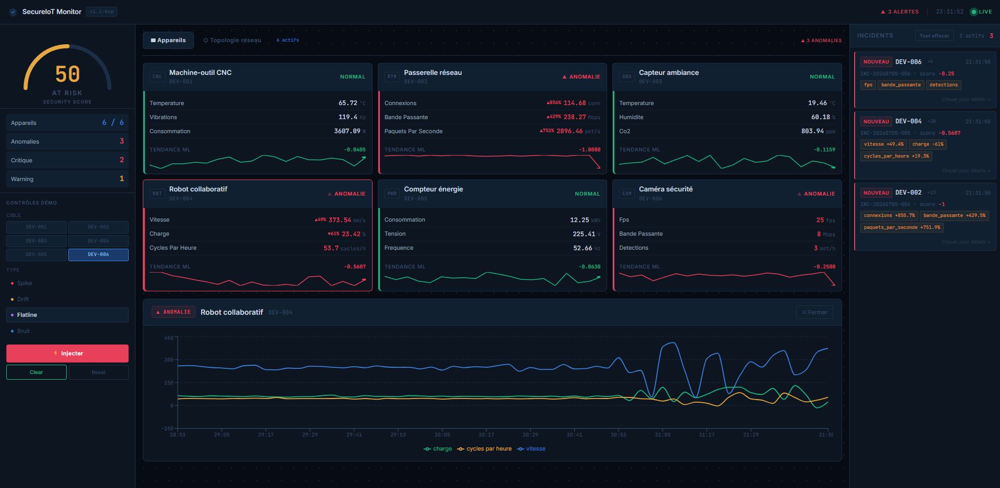
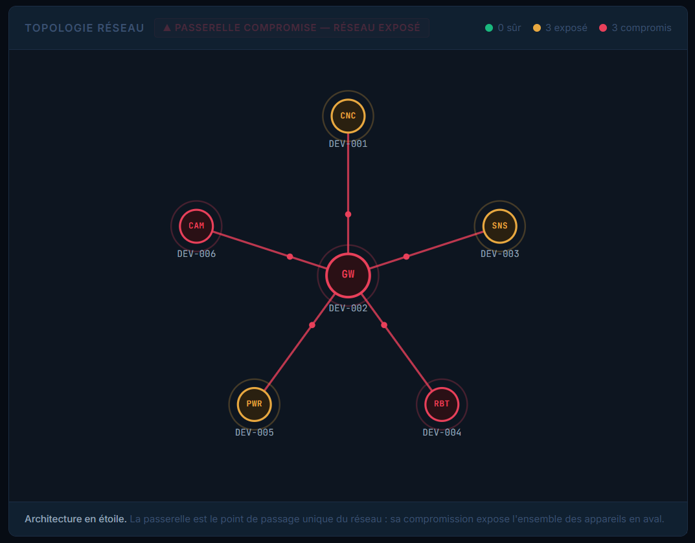
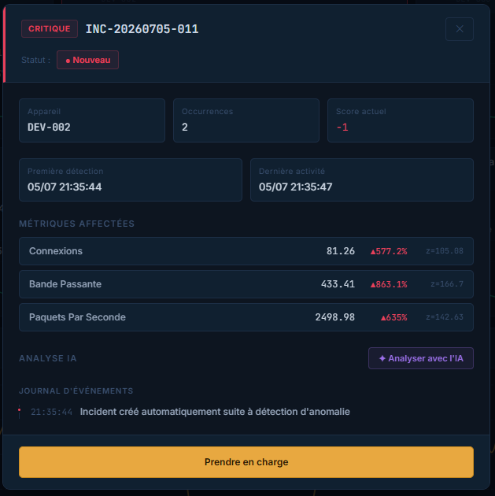
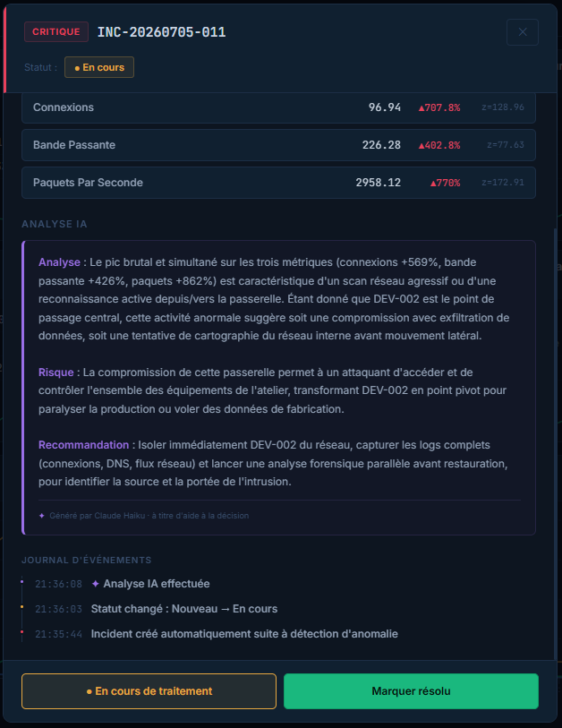

<div align="center">

# 🛡️ SecureIoT Monitor

**Plateforme de supervision de sécurité temps réel pour réseaux IoT industriels**

Détection d'anomalies par machine learning · Gestion d'incidents · Analyse assistée par IA · Cartographie de propagation de menace

[](https://www.python.org/)
[](https://fastapi.tiangolo.com/)
[](https://react.dev/)
[](https://scikit-learn.org/)
[](https://www.docker.com/)
[](https://www.anthropic.com/)

</div>

---

## Table des matières

- [Aperçu](#aperçu)
- [Le problème adressé](#le-problème-adressé)
- [Captures d'écran](#captures-décran)
- [Fonctionnalités](#fonctionnalités)
- [Architecture](#architecture)
- [Détection d'anomalies : approche technique](#détection-danomalies--approche-technique)
- [Gestion d'incidents](#gestion-dincidents)
- [Analyse assistée par IA](#analyse-assistée-par-ia)
- [Topologie et propagation de menace](#topologie-et-propagation-de-menace)
- [Stack technique](#stack-technique)
- [Installation](#installation)
- [Structure du projet](#structure-du-projet)
- [API](#api)
- [Perspectives](#perspectives)
- [Auteur](#auteur)

---

## Aperçu

**SecureIoT Monitor** est un tableau de bord de supervision de sécurité conçu pour les environnements IoT industriels (Industrie 4.0). La plateforme surveille en continu un parc d'équipements connectés, détecte automatiquement les comportements anormaux à l'aide d'un moteur de machine learning, orchestre le traitement des incidents selon un workflow inspiré des SOC (Security Operations Center), et fournit une analyse contextuelle générée par intelligence artificielle pour appuyer la décision opérationnelle.

Le projet combine trois disciplines : **la cybersécurité** (détection d'intrusion, réponse à incident), **le développement full-stack** (backend temps réel, interface de supervision) et **l'intelligence artificielle appliquée** (analyse d'incident en langage naturel).

---

## Le problème adressé

Les entreprises industrielles déploient un nombre croissant d'objets connectés : capteurs, machines-outils, robots collaboratifs, caméras, passerelles réseau. Ces équipements génèrent des flux de données continus, mais rares sont les PME disposant d'une infrastructure de supervision de sécurité dédiée. Une intrusion ou une défaillance peut alors passer inaperçue pendant des heures, avec des conséquences potentiellement graves : sabotage de production, exfiltration de données, ou danger physique dans le cas de robots collaboratifs.

SecureIoT Monitor répond à ce besoin en offrant une supervision temps réel qui ne se contente pas de détecter, mais qui **explique** et **oriente l'action**, rendant la sécurité IoT accessible même sans expertise SOC dédiée.

---

## Captures d'écran

### Tableau de bord — état nominal

Vue d'ensemble du parc surveillé : score de sécurité global, cartes des appareils avec leurs métriques temps réel et tendance ML, courbes détaillées au clic.



### Tableau de bord — anomalies actives

Détection en temps réel : les appareils compromis passent en rouge avec l'ampleur de la déviation (`+856%`), le score de sécurité chute, et les incidents s'accumulent dans le panneau latéral.



### Topologie réseau — propagation de menace

Cartographie de l'infrastructure en étoile. Lorsque la passerelle centrale est compromise, l'ensemble des équipements en aval passe en état « exposé », illustrant le risque de mouvement latéral.



### Gestion d'incident

Dossier d'incident complet : métriques affectées avec z-scores, journal d'événements horodaté, workflow de traitement (nouveau → en cours → résolu).



### Analyse assistée par IA

Sur demande, une analyse générée par Claude interprète l'incident en tenant compte de la nature de l'équipement, du pattern d'attaque et du contexte réseau, puis formule une recommandation d'action.



---

## Fonctionnalités

### Supervision temps réel
- Surveillance continue de 6 types d'équipements industriels (machine-outil CNC, passerelle réseau, capteur d'ambiance, robot collaboratif, compteur d'énergie, caméra de sécurité)
- Métriques mises à jour toutes les 2 secondes via un simulateur de flux IoT
- Score de sécurité global calculé dynamiquement
- Sparklines de tendance et graphiques détaillés temps réel (historique glissant)

### Détection d'anomalies par ML
- Moteur de détection hybride combinant analyse statistique (z-score) et détection de variance
- Quatre patterns d'attaque détectés : pic brutal, dérive progressive, signal figé, instabilité
- Mécanisme d'hystérésis pour éliminer le phénomène de *flapping* (oscillation d'état)
- Classification automatique de sévérité (normal / warning / critique)

### Gestion d'incidents (case management)
- Création automatique d'incidents à la détection, workflow inspiré de TheHive
- Cycle de vie complet : nouveau → en cours → résolu
- Journal d'événements horodaté par incident
- Cooldown de résolution et auto-résolution au retour à la normale
- Persistance des incidents traités pour investigation ultérieure

### Analyse assistée par IA
- Analyse d'incident en langage naturel générée à la demande (Claude Haiku)
- Contextualisation par la nature de l'équipement et son enjeu de sécurité spécifique
- Prise en compte du pattern d'attaque, de la propagation réseau et de l'historique
- Analyse persistée dans le dossier d'incident

### Cartographie de menace
- Topologie réseau interactive en étoile
- Modélisation de la propagation : compromission de la passerelle → exposition du réseau
- Visualisation animée des flux de menace

---

## Architecture

```
┌──────────────────────────────────────────────────────────────┐
│                      FRONTEND (React + Vite)                   │
│                                                                │
│   Dashboard      Topologie      Incidents      Analyse IA      │
│   temps réel     réseau         (modal)        (Claude)        │
└───────────────────────────────┬──────────────────────────────┘
                               │ REST / polling
┌───────────────────────────────▼──────────────────────────────┐
│                      BACKEND (FastAPI)                         │
│                                                                │
│  ┌────────────┐  ┌──────────────┐  ┌──────────────┐          │
│  │ Simulateur │  │  Détecteur   │  │  Gestionnaire│          │
│  │    IoT     │─▶│  d'anomalies │─▶│  d'incidents │          │
│  │            │  │  (ML hybride)│  │ (case mgmt)  │          │
│  └────────────┘  └──────────────┘  └──────┬───────┘          │
│                                            │                  │
│  ┌────────────┐                    ┌───────▼───────┐          │
│  │ Topologie  │                    │  Analyste IA  │          │
│  │ (propagation)                   │ (Claude Haiku)│          │
│  └────────────┘                    └───────────────┘          │
└───────────────────────────────┬──────────────────────────────┘
                               │
                       ┌───────▼───────┐
                       │  Claude API   │
                       └───────────────┘
```

L'ensemble est orchestré via **Docker Compose** avec rechargement à chaud (hot reload) sur le backend et le frontend pour un cycle de développement fluide.

---

## Détection d'anomalies : approche technique

Le cœur du système repose sur une **détection hybride** volontairement conçue pour être robuste et explicable, plutôt que sur une boîte noire.

### 1. Détection par z-score (déviation statistique)

Le système apprend le comportement normal de chaque métrique sur une fenêtre initiale saine (moyenne et écart-type). Pour chaque nouvelle mesure, il calcule un **z-score** :

```
z = |valeur − moyenne| / écart-type
```

Un z-score élevé signifie que la valeur s'écarte fortement de la normale. Les seuils de sévérité sont déterministes et cohérents entre tous les équipements, ce qui garantit une détection fiable indépendamment de l'échelle des données. Ce mécanisme capture les **pics** (spike), les **dérives** (drift) et l'**instabilité** (noise).

### 2. Détection de variance nulle (signal figé)

Le z-score ne détecte pas le cas où une valeur se **fige** sur sa baseline (capteur bloqué, déconnecté). Ce cas — le plus sournois car la valeur affichée semble « normale » — est capté par l'analyse de la variance sur une fenêtre récente : si la variation s'effondre alors qu'elle devrait osciller, un **flatline** est détecté.

### 3. Hystérésis (anti-flapping)

Pour éviter qu'un état oscille entre normal et anormal lorsque le signal est instable, un mécanisme d'hystérésis maintient l'état « anormal » pendant plusieurs cycles après le dernier signal. C'est le comportement standard des SIEM (*alert dampening*), qui évite la fatigue d'alerte.

---

## Gestion d'incidents

Le module de case management reproduit le workflow d'un SOC :

| Étape | Description |
|-------|-------------|
| **Détection** | Une anomalie confirmée génère automatiquement un incident (un seul par appareil) |
| **Nouveau** | L'incident est créé, la carte de l'appareil passe en rouge |
| **Prise en charge** | L'opérateur prend l'incident en charge, l'état passe en jaune |
| **Résolution** | La résolution coupe la source de l'anomalie et clôt l'incident |
| **Archivage** | L'incident résolu reste consultable pour investigation |

Deux mécanismes garantissent la cohérence : un **cooldown de résolution** empêche la recréation immédiate d'un incident sur un signal résiduel, et l'**auto-résolution** clôt automatiquement un incident dont l'appareil est revenu à la normale.

---

## Analyse assistée par IA

L'intégration de Claude transforme des données techniques (`z-score 133`, `connexions +538%`) en compréhension actionnable. À la demande de l'opérateur, une analyse structurée est générée :

- **Analyse** — l'hypothèse la plus probable sur ce qui s'est passé
- **Risque** — l'impact concret pour ce type d'équipement précis
- **Recommandation** — l'action prioritaire à mener

La force de l'intégration réside dans la **contextualisation** : le prompt injecte la nature de l'appareil et son enjeu de sécurité (une caméra qui fuit de la bande passante → exfiltration d'images ; un robot collaboratif qui accélère → danger physique pour les opérateurs), le pattern d'attaque détecté, l'état de propagation réseau et l'historique de l'incident. L'IA raisonne alors comme un analyste connaissant l'installation, et non de manière générique.

Le modèle **Claude Haiku** a été retenu pour son excellent rapport qualité/coût sur ce type de tâche d'analyse structurée. Les appels sont déclenchés uniquement à la demande, jamais automatiquement, pour un contrôle total de la consommation.

> Philosophie : *le ML détecte, l'IA explique et conseille, l'humain décide.*

---

## Topologie et propagation de menace

Le réseau est modélisé en **étoile** : une passerelle centrale relie tous les équipements. Cette architecture reflète la réalité des réseaux IoT industriels, où la passerelle constitue le point de passage unique — et donc le point de défaillance critique.

La logique de propagation encode un principe fondamental de sécurité : **si la passerelle est compromise, tout le réseau en aval est exposé** (mouvement latéral). La visualisation traduit ce risque en temps réel — les nœuds passent de « sûr » à « exposé » ou « compromis », et les liens de menace s'animent.

---

## Stack technique

| Couche | Technologies |
|--------|-------------|
| **Backend** | Python 3.11, FastAPI, Uvicorn |
| **Machine Learning** | scikit-learn, NumPy (détection hybride z-score + variance) |
| **Frontend** | React 19, Vite, Recharts |
| **Intelligence artificielle** | API Anthropic (Claude Haiku) |
| **Temps réel** | Polling REST, historique glissant en mémoire |
| **Infrastructure** | Docker, Docker Compose (hot reload) |

---

## Installation

### Prérequis
- Docker et Docker Compose
- Une clé API Anthropic ([console.anthropic.com](https://console.anthropic.com))

### Démarrage

```bash
# Cloner le dépôt
git clone https://github.com/AliEssassi/secureiot-monitor.git
cd secureiot-monitor

# Configurer la clé API
echo "ANTHROPIC_API_KEY=sk-ant-..." > backend/.env

# Lancer l'ensemble de la stack
docker compose up --build
```

L'interface est ensuite accessible sur **http://localhost:5173** et l'API sur **http://localhost:8000** (documentation interactive sur `/docs`).

### Commandes utiles

```bash
docker compose up -d          # démarrage en arrière-plan
docker compose restart        # redémarrage
docker compose logs -f backend # suivi des logs backend
docker compose down           # arrêt
```

---

## Structure du projet

```
secureiot-monitor/
├── backend/
│   ├── main.py                 # Point d'entrée FastAPI, routes API
│   ├── simulator.py            # Simulateur de flux IoT + contexte métier
│   ├── anomaly_detector.py     # Moteur de détection ML hybride
│   ├── incident_manager.py     # Gestion du cycle de vie des incidents
│   ├── topology.py             # Modèle réseau + logique de propagation
│   ├── ai_analyst.py           # Intégration Claude (analyse d'incident)
│   └── Dockerfile
├── frontend/
│   ├── src/
│   │   ├── App.jsx             # Composant racine, layout, polling
│   │   └── components/
│   │       ├── Header.jsx
│   │       ├── Sidebar.jsx         # Score de sécurité + contrôles
│   │       ├── ThreatMeter.jsx     # Jauge de sécurité (SVG)
│   │       ├── DeviceCard.jsx      # Carte d'appareil + sparkline
│   │       ├── DetailPanel.jsx     # Graphiques temps réel (Recharts)
│   │       ├── AlertPanel.jsx      # Panneau d'incidents
│   │       ├── IncidentModal.jsx   # Dossier d'incident + analyse IA
│   │       └── NetworkTopology.jsx # Cartographie réseau (SVG)
│   └── Dockerfile
├── docs/screenshots/
└── docker-compose.yml
```

---

## API

Principales routes exposées par le backend :

| Méthode | Route | Description |
|---------|-------|-------------|
| `GET` | `/api/snapshot` | État temps réel de tous les appareils + analyse ML |
| `GET` | `/api/history/{device_id}` | Historique des métriques d'un appareil |
| `GET` | `/api/incidents` | Liste des incidents |
| `GET` | `/api/incidents/{id}` | Détail d'un incident |
| `PATCH` | `/api/incidents/{id}/status` | Mise à jour du statut d'un incident |
| `POST` | `/api/incidents/{id}/analyze` | Génération de l'analyse IA |
| `GET` | `/api/topology` | État de la topologie + propagation |
| `POST` | `/api/inject-anomaly` | Injection d'une anomalie (démo) |
| `POST` | `/api/clear-anomaly/{device_id}` | Suppression d'une anomalie |

La documentation interactive complète (Swagger) est générée automatiquement sur `/docs`.

---

## Perspectives

Pistes d'évolution envisagées pour une version ultérieure :

- **Criticité par appareil** — pondération du score de sécurité selon l'importance métier de chaque équipement
- **Corrélation multi-incidents** — détection d'attaques coordonnées touchant plusieurs appareils simultanément
- **Mapping MITRE ATT&CK for ICS** — association des incidents aux techniques du référentiel standard de sécurité industrielle
- **Rapport de synthèse automatique** — génération d'un rapport exécutif 24h par IA
- **Passage en production** — remplacement du simulateur par un broker MQTT réel, base de données time-series (InfluxDB), déploiement du modèle ML sur serveur dédié

---

## Auteur

**ESSASSI Ali** — Ingénieur en sécurité informatique (INSA Centre Val de Loire)

[](https://www.linkedin.com/in/ali-essassi-a23a94247/)

---

<div align="center">

*Projet développé comme démonstration technique à l'intersection de la cybersécurité, du développement full-stack et de l'intelligence artificielle appliquée.*

</div>
